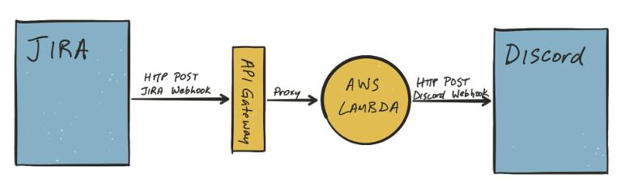

# JIRA Discord AWS Lambda Webhook
A simple AWS lambda function that takes a JIRA webhook payload, creates a Discord-compatible webhook payload, and executes the appropriate Discord webhook. This repository is inspired by aucerna/jira-discord-lambda which was written with scala. This repository however is code in dotnet. Some of the functionality has been changed to accommodate my specification.

Setup instruction:
1) Create an AWS Lambda function. Choose .Net 6(C#/PowerShell) as the runtime and upload the published code.
2) Change the handler to JiraDiscord::JiraDiscord.Program::Handler
3) Create an HTTP API in AWS API Gateway
4) Add integration with the lambda function. Choose Version 2.0
5) Define your preferred route.
6) Create a webhook in Discord, take note the URL will contain the discord id and token.
7) Create JIRA webhook from setting->system->WebHooks.
8) Fill in the URL with this format: (https://[Api_Url]/[Route]?proxy=[Discord_Id]/[Discord_Token]&projectKey=${project.key})
9) Save and test the webhook.

The diagram below shows how the flow work. Credit to aucerna. See his blog post to see more depth in technical view. 

### Resources
https://github.com/aucerna/jira-discord-lambda
https://discordapp.com/developers/docs/resources/webhook#execute-webhook
